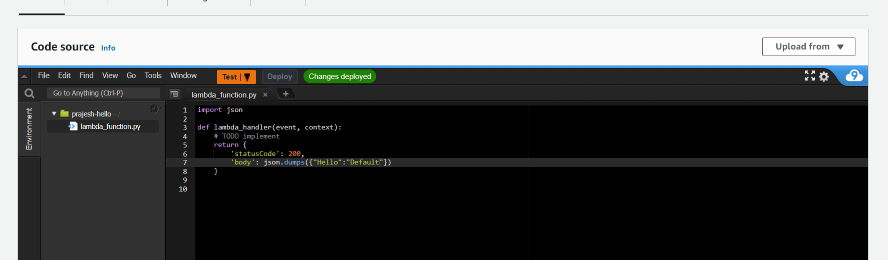
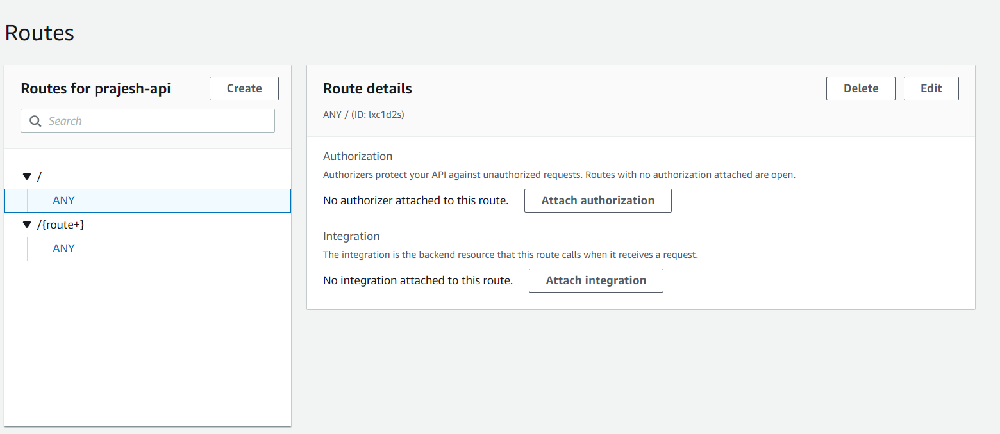
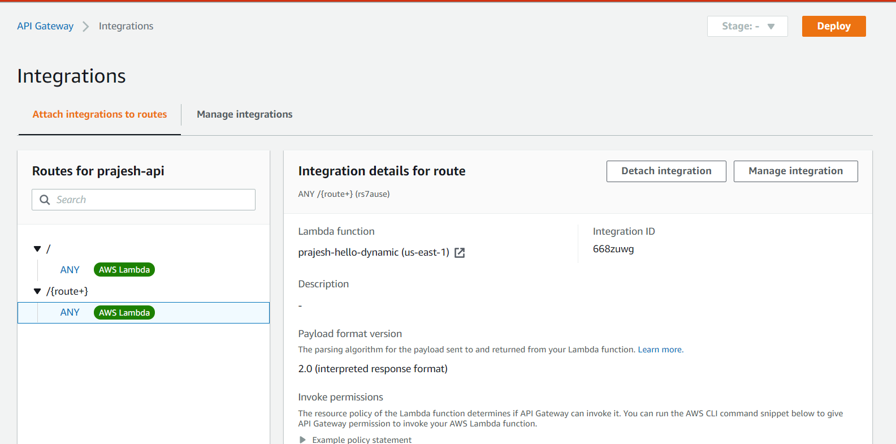
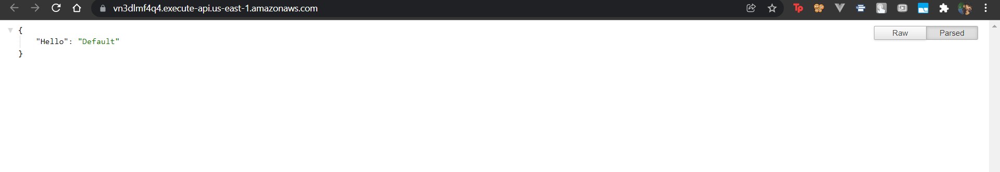
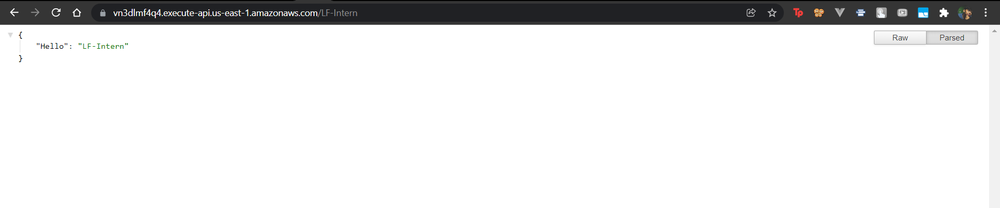

> Create two Lambda Functions
> First Lambda function returns 200 Response as {“Hello”: “Default”}

First Lambda function to return 200, it can be done just editing the code as such

```
import json

def lambda_handler(event, context):
    # TODO implement
    return {
        'statusCode': 200,
        'body': json.dumps({"Hello":"Default"})
    }

```

---

> Second Lambda function returns 200 Response as
{“Hello”: “{Dynamic route name}”}

In similar way the second labda function can be edited as 

```
import json

def lambda_handler(event, context):
    # TODO implement
    return {
        'statusCode': 200,
        'body': json.dumps({"Hello": event["rawPath"].strip('/')})
    }

```


---

> Configure API Gateway with that hits first lambda function on /
and the second lambda function on /*

So to access these lambda function from the web we can use API Gateway as its trigger


Now to use first lambda on /,
and use second lambda on /*, 
we edit the routes as such: 



Now to integrate the lambda function to the routes




So the result of First lambda can be shown in the root path "/"



Second Lambda function's output is dynamic this for the route "/LF-intern"
