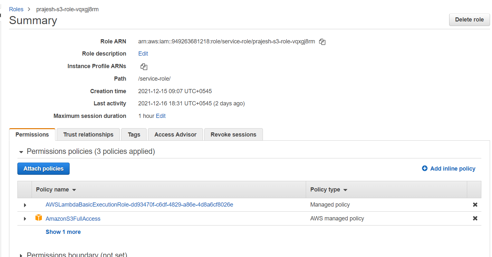
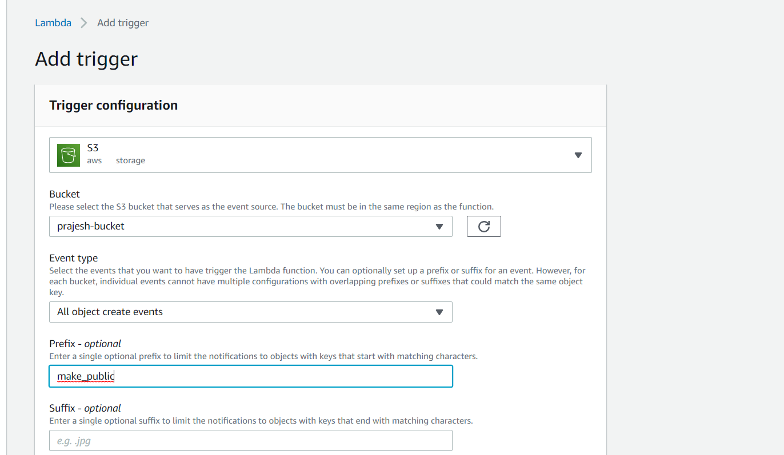
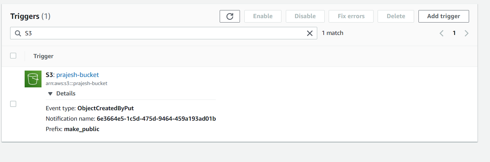

> Create a Lambda function that is triggered by an object being uploaded to an S3 bucket. If the object’s name starts with make_public, ensure that the object is publicly accessible.

Here Lambda function is created named **prajesh_s3**

The code of the function is 

```
import json
import boto3

s3=boto3.resource('s3')
def lambda_handler(event, context):
    # TODO implement
    for record in event['Records']:
            
        bucket_name=record['s3']['bucket']['name']
        #keep key always in " "
        object_name=record['s3']['object']["key"]
        
        #initializing an s3 resourcce
        
        #getting the uploaded public object
        acl=s3.ObjectAcl(bucket_name, object_name)
        
        #get the ACL object for the uploaded object
        # acl=public_object.Acl()
        
        #make the object publicly accessible
        acl.put(ACL='public-read')
```


Here I came into some issues with the permission for changing the ACL of the object

So we need to authorize the role created for Lambda function with the permission to change the ACL of object in IAM.




Not this function changes the permission of the dump file to be accessible to the public if prefix **make_public** is given. This can be set using the trigger of Lambda function.






Now the files with prefix ```make_public``` is made publicly accesible.
