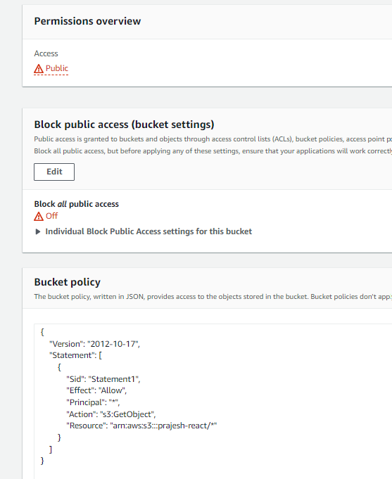
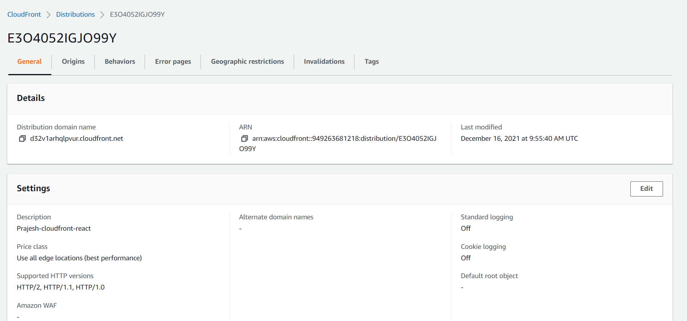

> Host a react application on an S3 Bucket and deliver it through cloudfront.

To host react application first we need to build the app after it is set up

```
npm run build
```

This commands creates a build file, which is then used to deploy using vcarious services. 
In our case, we will be using S3 bucket to store the build file and cloudfront to host it. Cloudfront is aws option for CDN server. 

First The S3 Bucket needs to be able to host the files as a http website. So **Static website hosting** is enabled


And also the GetObject permission for the bucket must be granted to the public which can be done using the policy.

```
{
    "Version": "2012-10-17",
    "Statement": [
        {
            "Sid": "Statement1",
            "Effect": "Allow",
            "Principal": "*",
            "Action": "s3:GetObject",
            "Resource": "arn:aws:s3:::prajesh-react/*"
        }
    ]
}
```




Now we can access the react app with the link provided but this is not cloudfront hosted and is served from the AWS region where the bucket is located, in our case us-east-1,

To make the website accasible fast we use cloudfront. So now to create a cloudfront distribution.



This may take some time as the files are being cached at all the AWS servers.

