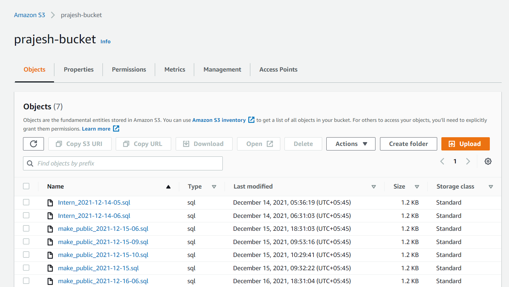
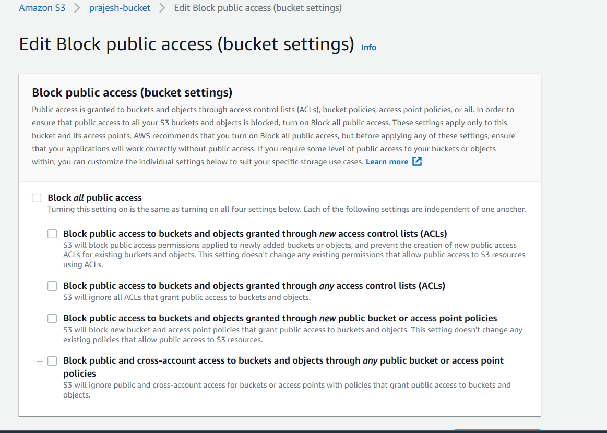
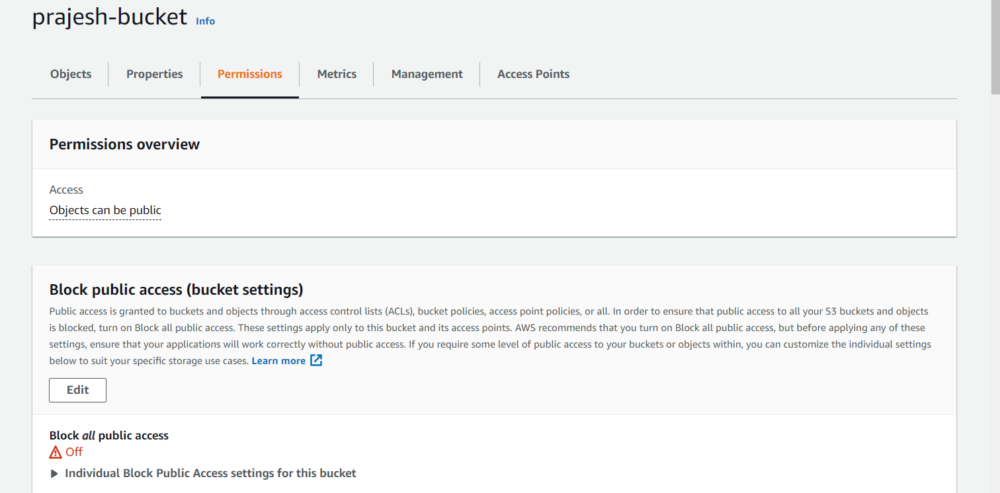
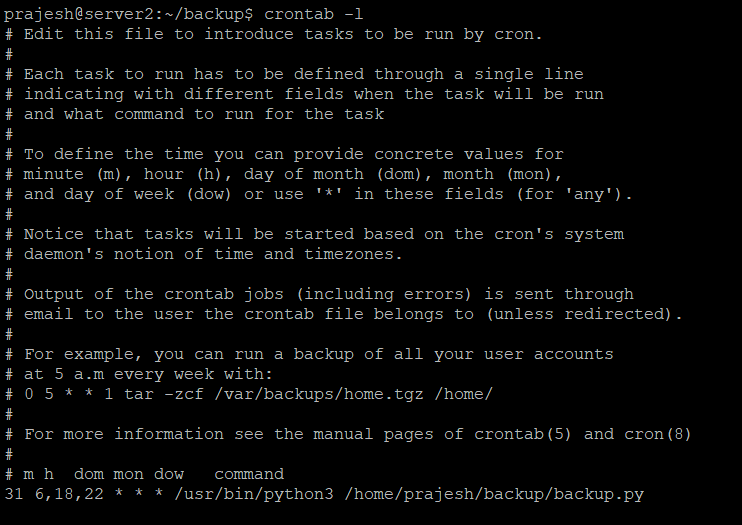

> Write a script that backs up an SQL dump and uploads it to an S3 Bucket. The contents of the S3 bucket should not be accessible via public.

First to create SQL Dump nad to upload it to S3, bash script is created **backup.py**

boto3 package was used to *PUT* dump file to the S3 bucket

The s3 bucket *prajesh-bucket* is also created with the permission that makes objects not accessible via public

Permissions could be seen in the permissions tab

If tried to access, the given promp is shown

Now, backups are done periodically in some specific time, we can run the bash script with **cronjob**, and schedule the time to run the script

here the cronjob is run at times: 6:31, 18:31, 22:21